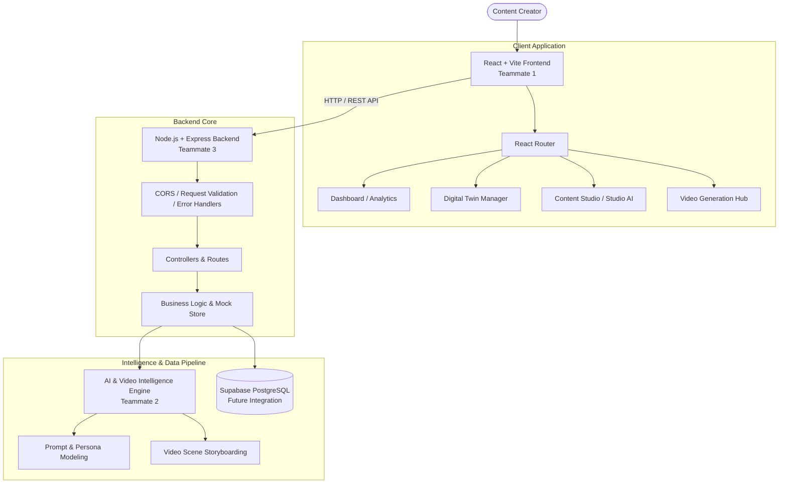

# CreatorAI Architecture & System Design

## 1. System Overview

CreatorAI is an AI-powered operating platform designed to empower content creators to ideate, script, produce, and optimize multimedia content at scale without losing their authentic personal brand.

At the core of the system is the **Creator Digital Twin**—a structured persona model encoding the creator's voice, niche, audience pain points, visual aesthetics, and pacing.

---

## 2. Team Division & Roles

To ensure parallel development during the hackathon, clear boundaries are defined:

| Role | Team Member | Primary Domain | Work Directory & Focus |
|---|---|---|---|
| **Frontend** | Teammate 1 | UI/UX, responsive components, routing, data visualization | `frontend/` (React, Vite, Lucide Icons, Recharts) |
| **AI / Video Intelligence** | Teammate 2 | Digital Twin persona algorithms, prompt engineering, video storyboards | `backend/src/services/` & AI pipelines |
| **Backend & Integration** | Teammate 3 | Express REST API, validation, database integration, auth | `backend/` & Supabase schema |

---

## 3. Core Architectural Modules

### A. Creator Digital Twin Engine
- Acts as the context provider for every generative task.
- Ensures generated hooks, scripts, and video prompts match the creator's unique voice.

### B. Content Generation Pipeline
- Generates multi-platform assets (Instagram Reels, YouTube Shorts, LinkedIn Carousels).
- Outputs structured scripts with timecoded hooks, body beats, captions, and hashtags.

### C. Video Storyboard & Pipeline
- Converts raw scripts into structured video scenes with camera directions, b-roll prompts, and speech audio timing.

### D. Analytics & Feedback Loop
- Gathers performance metrics across platforms to refine the Digital Twin parameters over time.

---

## 4. Current State (Phase 1 Foundation)
- Frontend: Single-page React application with modular layouts, routing, and starter pages.
- Backend: Modular Express REST API with input validation (Zod) and realistic mock data repositories.
- Contracts: Rigid Markdown API contracts governing data structures between frontend, backend, and AI.
