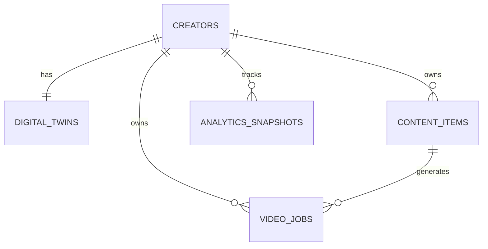

# Database Schema Design (Supabase / PostgreSQL)

This document outlines the planned database structure for CreatorAI when connecting to Supabase PostgreSQL in Phase 2.

---

## Entity Relationship Overview



---

## 1. `creators` Table
Stores basic creator account details and high-level profile data.

```sql
CREATE TABLE creators (
    id UUID PRIMARY KEY DEFAULT gen_random_uuid(),
    email VARCHAR(255) UNIQUE NOT NULL,
    name VARCHAR(255) NOT NULL,
    bio TEXT,
    primary_niche VARCHAR(120) NOT NULL,
    social_handles JSONB DEFAULT '{}'::jsonb,
    avatar_url TEXT,
    created_at TIMESTAMPTZ DEFAULT NOW(),
    updated_at TIMESTAMPTZ DEFAULT NOW()
);
```

---

## 2. `digital_twins` Table
Stores the persona model, tone parameters, and stylistic traits for each creator.

```sql
CREATE TABLE digital_twins (
    id UUID PRIMARY KEY DEFAULT gen_random_uuid(),
    creator_id UUID UNIQUE NOT NULL REFERENCES creators(id) ON DELETE CASCADE,
    target_audience JSONB NOT NULL DEFAULT '{}'::jsonb,
    tone JSONB NOT NULL DEFAULT '{"primary": "friendly", "attributes": []}'::jsonb,
    preferred_platforms TEXT[] DEFAULT ARRAY['instagram', 'youtube'],
    content_style JSONB NOT NULL DEFAULT '{}'::jsonb,
    interests TEXT[] DEFAULT ARRAY[]::TEXT[],
    preferences JSONB NOT NULL DEFAULT '{}'::jsonb,
    past_content_reference JSONB DEFAULT '[]'::jsonb,
    created_at TIMESTAMPTZ DEFAULT NOW(),
    updated_at TIMESTAMPTZ DEFAULT NOW()
);
```

---

## 3. `content_items` Table
Stores AI-generated scripts, hooks, captions, and publication metadata.

```sql
CREATE TABLE content_items (
    id UUID PRIMARY KEY DEFAULT gen_random_uuid(),
    creator_id UUID NOT NULL REFERENCES creators(id) ON DELETE CASCADE,
    topic VARCHAR(255) NOT NULL,
    platform VARCHAR(50) NOT NULL,
    content_type VARCHAR(50) NOT NULL,
    tone VARCHAR(80),
    hook TEXT NOT NULL,
    script TEXT NOT NULL,
    caption TEXT,
    hashtags TEXT[] DEFAULT ARRAY[]::TEXT[],
    status VARCHAR(50) DEFAULT 'draft',
    created_at TIMESTAMPTZ DEFAULT NOW(),
    updated_at TIMESTAMPTZ DEFAULT NOW()
);
```

---

## 4. `video_jobs` Table
Tracks video storyboard generation and rendering status.

```sql
CREATE TABLE video_jobs (
    id UUID PRIMARY KEY DEFAULT gen_random_uuid(),
    creator_id UUID NOT NULL REFERENCES creators(id) ON DELETE CASCADE,
    content_id UUID REFERENCES content_items(id) ON DELETE SET NULL,
    title VARCHAR(255) NOT NULL,
    script TEXT NOT NULL,
    aspect_ratio VARCHAR(20) DEFAULT '9:16',
    status VARCHAR(50) DEFAULT 'processing',
    progress_percentage INT DEFAULT 0,
    scenes JSONB DEFAULT '[]'::jsonb,
    audio_url TEXT,
    video_url TEXT,
    thumbnail_url TEXT,
    created_at TIMESTAMPTZ DEFAULT NOW(),
    completed_at TIMESTAMPTZ
);
```

---

## 5. `analytics_snapshots` Table
Periodic performance aggregations and AI recommendations.

```sql
CREATE TABLE analytics_snapshots (
    id UUID PRIMARY KEY DEFAULT gen_random_uuid(),
    creator_id UUID NOT NULL REFERENCES creators(id) ON DELETE CASCADE,
    period VARCHAR(20) DEFAULT '30d',
    summary JSONB NOT NULL DEFAULT '{}'::jsonb,
    platform_breakdown JSONB NOT NULL DEFAULT '[]'::jsonb,
    top_performing_content JSONB NOT NULL DEFAULT '[]'::jsonb,
    ai_insights TEXT[] DEFAULT ARRAY[]::TEXT[],
    recorded_at TIMESTAMPTZ DEFAULT NOW()
);
```
